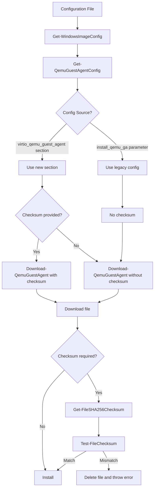
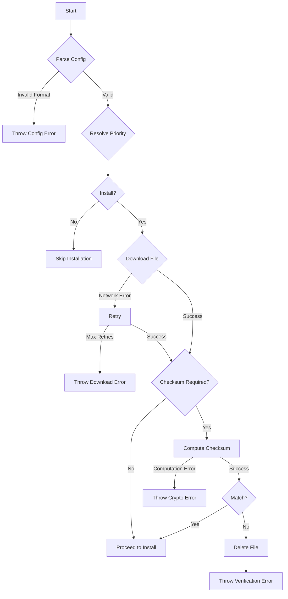

# Design Document: QEMU Guest Agent Checksum Verification

## Overview

This design document specifies the technical implementation for adding SHA256 checksum verification to the QEMU Guest Agent installation process in the Windows OpenStack Imaging Tools PowerShell codebase. The feature enhances security by verifying downloaded file integrity while maintaining full backward compatibility with existing configurations.

The implementation introduces a new `[virtio_qemu_guest_agent]` configuration section that supports both URL and optional SHA256 checksum parameters. The design follows a priority-based configuration resolution system where the new section takes precedence over the legacy `install_qemu_ga` parameter in the `[custom]` section. This ensures that existing configurations continue to work without modification while enabling users to opt into checksum verification.

The core enhancement involves modifying the `Download-QemuGuestAgent` function in `WinImageBuilder.psm1` to perform SHA256 checksum verification when a checksum is provided. The implementation uses .NET Framework's `System.Security.Cryptography.SHA256` class for cryptographic hash computation, ensuring FIPS 180-4 compliance.

### Key Design Principles

1. **Backward Compatibility**: All existing configurations must continue to work without modification
2. **Security by Default**: When checksums are provided, verification is mandatory and failures prevent installation
3. **Clear Priority System**: Configuration resolution follows a well-defined priority order
4. **Separation of Concerns**: Checksum computation, verification, and configuration parsing are separate functions
5. **Fail-Safe Behavior**: Checksum verification failures result in file deletion and clear error messages

## Architecture

### Component Overview

The implementation consists of four main components:

1. **Configuration Parser** (`Config.psm1`)
   - Extends `Get-AvailableConfigOptions` to include new `[virtio_qemu_guest_agent]` section parameters
   - Validates checksum format (64-character hexadecimal string)
   - Provides configuration metadata for documentation generation

2. **Configuration Resolution** (`WinImageBuilder.psm1`)
   - New function: `Get-QemuGuestAgentConfig`
   - Implements priority-based configuration resolution
   - Returns a hashtable with URL and optional checksum

3. **Checksum Computation** (`WinImageBuilder.psm1`)
   - New function: `Get-FileSHA256Checksum`
   - Computes SHA256 hash of a file using .NET Framework
   - Returns lowercase hexadecimal string representation

4. **Checksum Verification** (`WinImageBuilder.psm1`)
   - New function: `Test-FileChecksum`
   - Performs case-insensitive comparison of checksums
   - Deletes file and throws error on mismatch

5. **Download Manager** (`WinImageBuilder.psm1`)
   - Modified function: `Download-QemuGuestAgent`
   - Integrates configuration resolution and checksum verification
   - Maintains existing download and retry logic

### Data Flow



### Configuration Priority System

The configuration resolution follows this priority order:

1. **Highest Priority**: `[virtio_qemu_guest_agent]` section with both `url` and `checksum` parameters
2. **Medium Priority**: `[virtio_qemu_guest_agent]` section with only `url` parameter
3. **Low Priority**: `install_qemu_ga` parameter in `[custom]` section (legacy)
4. **No Installation**: `install_qemu_ga=False` or empty, or no configuration present

## Components and Interfaces

### 1. Configuration Options Extension

**Location**: `Config.psm1` - `Get-AvailableConfigOptions` function

**New Configuration Options**:

```powershell
@{"Name" = "url"; "GroupName" = "virtio_qemu_guest_agent";
  "Description" = "The URL to download the QEMU Guest Agent MSI installer.
                   If specified, this takes priority over the install_qemu_ga parameter.
                   Example: https://fedorapeople.org/groups/virt/virtio-win/direct-downloads/archive-qemu-ga/qemu-ga-win-100.0.0.0-3.el7ev/qemu-ga-x64.msi"},

@{"Name" = "checksum"; "GroupName" = "virtio_qemu_guest_agent";
  "Description" = "The SHA256 checksum of the QEMU Guest Agent MSI installer.
                   Must be a 64-character hexadecimal string.
                   If specified, the downloaded file will be verified against this checksum.
                   If verification fails, the installation will be aborted.
                   Example: a1b2c3d4e5f6..."}
```

**Validation Logic**:
- The `checksum` parameter, if provided, must match the regex pattern: `^[a-fA-F0-9]{64}$`
- Validation occurs during configuration parsing in `Get-WindowsImageConfig`

### 2. Configuration Resolution Function

**Function**: `Get-QemuGuestAgentConfig`

**Location**: `WinImageBuilder.psm1`

**Purpose**: Implements priority-based configuration resolution for QEMU Guest Agent installation

**Signature**:
```powershell
function Get-QemuGuestAgentConfig {
    Param(
        [Parameter(Mandatory=$true)]
        [hashtable]$Config,
        [Parameter(Mandatory=$true)]
        [string]$OsArch
    )
    # Returns: @{
    #   "Url" = <string or $null>
    #   "Checksum" = <string or $null>
    #   "Install" = <boolean>
    # }
}
```

**Logic**:
1. Check if `$Config['url']` (from `[virtio_qemu_guest_agent]` section) is present and non-empty
   - If yes: Return URL and checksum (if present) with `Install=$true`
2. If not, check `$Config['install_qemu_ga']` (legacy parameter)
   - If `'True'`: Generate default Fedora URL based on `$OsArch`, return with `Install=$true`, `Checksum=$null`
   - If custom URL: Return that URL with `Install=$true`, `Checksum=$null`
   - If `'False'` or empty: Return with `Install=$false`
3. If neither present: Return with `Install=$false`

**Default URL Generation**:
```powershell
$arch = if ($OsArch -eq "AMD64") { "x64" } else { "x86" }
$defaultUrl = "https://fedorapeople.org/groups/virt/virtio-win/direct-downloads" +
              "/archive-qemu-ga/qemu-ga-win-100.0.0.0-3.el7ev/qemu-ga-{0}.msi" -f $arch
```

### 3. Checksum Computation Function

**Function**: `Get-FileSHA256Checksum`

**Location**: `WinImageBuilder.psm1`

**Purpose**: Computes SHA256 hash of a file

**Signature**:
```powershell
function Get-FileSHA256Checksum {
    Param(
        [Parameter(Mandatory=$true)]
        [string]$FilePath
    )
    # Returns: string (64-character lowercase hexadecimal)
}
```

**Implementation**:
```powershell
function Get-FileSHA256Checksum {
    Param(
        [Parameter(Mandatory=$true)]
        [string]$FilePath
    )
    
    if (-not (Test-Path $FilePath)) {
        throw "File not found: $FilePath"
    }
    
    $sha256 = [System.Security.Cryptography.SHA256]::Create()
    try {
        $fileStream = [System.IO.File]::OpenRead($FilePath)
        try {
            $hashBytes = $sha256.ComputeHash($fileStream)
            $hashString = [System.BitConverter]::ToString($hashBytes) -replace '-', ''
            return $hashString.ToLower()
        } finally {
            $fileStream.Close()
        }
    } finally {
        $sha256.Dispose()
    }
}
```

**Key Design Decisions**:
- Uses .NET `System.Security.Cryptography.SHA256` for FIPS 180-4 compliance
- Returns lowercase hexadecimal for consistency
- Properly disposes of file stream and cryptographic provider
- Throws exception if file doesn't exist

### 4. Checksum Verification Function

**Function**: `Test-FileChecksum`

**Location**: `WinImageBuilder.psm1`

**Purpose**: Verifies file checksum matches expected value

**Signature**:
```powershell
function Test-FileChecksum {
    Param(
        [Parameter(Mandatory=$true)]
        [string]$FilePath,
        [Parameter(Mandatory=$true)]
        [string]$ExpectedChecksum
    )
    # Returns: void (throws exception on mismatch)
}
```

**Implementation**:
```powershell
function Test-FileChecksum {
    Param(
        [Parameter(Mandatory=$true)]
        [string]$FilePath,
        [Parameter(Mandatory=$true)]
        [string]$ExpectedChecksum
    )
    
    Write-Log "Verifying checksum for file: $FilePath"
    $actualChecksum = Get-FileSHA256Checksum -FilePath $FilePath
    $expectedLower = $ExpectedChecksum.ToLower()
    
    if ($actualChecksum -ne $expectedLower) {
        Write-Log "Checksum verification failed!"
        Write-Log "Expected: $expectedLower"
        Write-Log "Actual:   $actualChecksum"
        
        # Delete the file with failed verification
        Remove-Item -Path $FilePath -Force -ErrorAction SilentlyContinue
        
        throw ("Checksum verification failed for {0}. Expected: {1}, Actual: {2}" -f `
               $FilePath, $expectedLower, $actualChecksum)
    }
    
    Write-Log "Checksum verification successful: $actualChecksum"
}
```

**Key Design Decisions**:
- Performs case-insensitive comparison by converting both to lowercase
- Logs both expected and actual checksums on failure for debugging
- Deletes file immediately on verification failure
- Throws exception to halt installation process

### 5. Modified Download Function

**Function**: `Download-QemuGuestAgent` (modified)

**Location**: `WinImageBuilder.psm1`

**Current Signature**:
```powershell
function Download-QemuGuestAgent {
    Param(
        [Parameter(Mandatory=$true)]
        [string]$QemuGuestAgentConfig,
        [Parameter(Mandatory=$true)]
        [string]$ResourcesDir,
        [Parameter(Mandatory=$true)]
        [string]$OsArch
    )
}
```

**New Signature**:
```powershell
function Download-QemuGuestAgent {
    Param(
        [Parameter(Mandatory=$true)]
        [hashtable]$Config,
        [Parameter(Mandatory=$true)]
        [string]$ResourcesDir,
        [Parameter(Mandatory=$true)]
        [string]$OsArch
    )
}
```

**Modified Logic**:
```powershell
function Download-QemuGuestAgent {
    Param(
        [Parameter(Mandatory=$true)]
        [hashtable]$Config,
        [Parameter(Mandatory=$true)]
        [string]$ResourcesDir,
        [Parameter(Mandatory=$true)]
        [string]$OsArch
    )

    # Resolve configuration using priority system
    $qemuConfig = Get-QemuGuestAgentConfig -Config $Config -OsArch $OsArch
    
    if (-not $qemuConfig.Install) {
        Write-Log "QEMU Guest Agent installation is disabled"
        return
    }
    
    $url = $qemuConfig.Url
    $checksum = $qemuConfig.Checksum
    
    Write-Log "Downloading QEMU guest agent installer from ${url} ..."
    if ($checksum) {
        Write-Log "Checksum verification will be performed: $checksum"
    } else {
        Write-Log "No checksum provided, skipping verification"
    }
    
    $dst = Join-Path $ResourcesDir "qemu-ga.msi"
    Execute-Retry {
        (New-Object System.Net.WebClient).DownloadFile($url, $dst)
    }
    
    # Perform checksum verification if checksum was provided
    if ($checksum) {
        Test-FileChecksum -FilePath $dst -ExpectedChecksum $checksum
    }
    
    Write-Log "QEMU guest agent installer path is: $dst"
}
```

**Key Changes**:
- Parameter changed from `[string]$QemuGuestAgentConfig` to `[hashtable]$Config`
- Calls `Get-QemuGuestAgentConfig` to resolve configuration
- Checks `Install` flag before proceeding
- Performs checksum verification if checksum is provided
- Maintains existing download retry logic with `Execute-Retry`

### 6. Caller Updates

**Location**: Various locations in `WinImageBuilder.psm1` where `Download-QemuGuestAgent` is called

**Current Call Pattern**:
```powershell
Download-QemuGuestAgent -QemuGuestAgentConfig $config.install_qemu_ga `
                        -ResourcesDir $resourcesDir `
                        -OsArch $osArch
```

**New Call Pattern**:
```powershell
Download-QemuGuestAgent -Config $config `
                        -ResourcesDir $resourcesDir `
                        -OsArch $osArch
```

**Impact**: All callers must pass the full config hashtable instead of just the `install_qemu_ga` value

## Data Models

### Configuration Data Structure

**Input**: INI file with sections and key-value pairs

**Example Configuration (New Section)**:
```ini
[virtio_qemu_guest_agent]
url = https://fedorapeople.org/groups/virt/virtio-win/direct-downloads/archive-qemu-ga/qemu-ga-win-100.0.0.0-3.el7ev/qemu-ga-x64.msi
checksum = a1b2c3d4e5f6789012345678901234567890123456789012345678901234abcd
```

**Example Configuration (Legacy)**:
```ini
[custom]
install_qemu_ga = True
```

**Parsed Configuration Hashtable**:
```powershell
@{
    "url" = "https://..."  # From [virtio_qemu_guest_agent] section
    "checksum" = "a1b2c3..."  # From [virtio_qemu_guest_agent] section
    "install_qemu_ga" = "True"  # From [custom] section (legacy)
    # ... other config options
}
```

### QEMU Guest Agent Configuration Object

**Structure**: Hashtable returned by `Get-QemuGuestAgentConfig`

```powershell
@{
    "Url" = <string or $null>       # Download URL
    "Checksum" = <string or $null>  # SHA256 checksum (64 hex chars)
    "Install" = <boolean>           # Whether to install
}
```

**Examples**:

1. New section with checksum:
```powershell
@{
    "Url" = "https://example.com/qemu-ga-x64.msi"
    "Checksum" = "a1b2c3d4..."
    "Install" = $true
}
```

2. New section without checksum:
```powershell
@{
    "Url" = "https://example.com/qemu-ga-x64.msi"
    "Checksum" = $null
    "Install" = $true
}
```

3. Legacy config with default URL:
```powershell
@{
    "Url" = "https://fedorapeople.org/groups/virt/virtio-win/..."
    "Checksum" = $null
    "Install" = $true
}
```

4. Installation disabled:
```powershell
@{
    "Url" = $null
    "Checksum" = $null
    "Install" = $false
}
```

### Checksum Format

**Format**: 64-character hexadecimal string (SHA256 hash)

**Validation Regex**: `^[a-fA-F0-9]{64}$`

**Case Handling**: Case-insensitive comparison (both converted to lowercase)

**Examples**:
- Valid: `a1b2c3d4e5f6789012345678901234567890123456789012345678901234abcd`
- Valid: `A1B2C3D4E5F6789012345678901234567890123456789012345678901234ABCD`
- Valid: `A1b2C3d4E5f6789012345678901234567890123456789012345678901234aBcD`
- Invalid: `a1b2c3d4` (too short)
- Invalid: `g1b2c3d4e5f6789012345678901234567890123456789012345678901234abcd` (invalid character 'g')


## Correctness Properties

*A property is a characteristic or behavior that should hold true across all valid executions of a system—essentially, a formal statement about what the system should do. Properties serve as the bridge between human-readable specifications and machine-verifiable correctness guarantees.*

### Property Reflection

After analyzing all acceptance criteria, I identified the following redundancies:

**Redundant Properties**:
- Requirements 4.1, 4.2, 4.3 are covered by 3.3, 3.4, 3.5 (backward compatibility cases)
- Requirement 5.2 is covered by 2.2 (checksum verification success path)
- Requirement 5.4 is covered by 2.3 (checksum verification failure path)
- Requirement 3.6 is covered by 3.1 and 3.2 (priority order)
- Requirement 8.1 is covered by 1.4 and 1.5 (validation before downloads)

**Combined Properties**:
- Requirements 1.2 and 1.3 can be combined into a single property about parameter extraction
- Requirements 3.1 and 3.2 can be combined into a single property about new section priority

The following properties represent the unique, non-redundant correctness guarantees:

### Property 1: Configuration Section Recognition

*For any* INI file containing a `[virtio_qemu_guest_agent]` section with parameters, the Configuration_Parser should successfully extract all parameters from that section.

**Validates: Requirements 1.1, 1.2, 1.3**

### Property 2: Checksum Format Validation

*For any* string provided as a checksum parameter, the Configuration_Parser should accept it if and only if it matches the pattern of a 64-character hexadecimal string (case-insensitive).

**Validates: Requirements 1.4, 1.5**

### Property 3: Checksum Computation Idempotence

*For any* file, computing the SHA256 checksum multiple times should always produce identical results.

**Validates: Requirements 2.1, 2.6**

### Property 4: Checksum Verification Success

*For any* downloaded file where the computed SHA256 hash matches the provided checksum (case-insensitive), the Checksum_Verifier should allow the installation to proceed without errors.

**Validates: Requirements 2.2, 2.4**

### Property 5: Checksum Verification Failure and Cleanup

*For any* downloaded file where the computed SHA256 hash does not match the provided checksum, the Checksum_Verifier should delete the file and throw an error preventing installation.

**Validates: Requirements 2.3**

### Property 6: New Configuration Section Priority

*For any* configuration containing a `[virtio_qemu_guest_agent]` section with a url parameter, the Priority_System should use that URL (and checksum if provided) regardless of any legacy `install_qemu_ga` parameter value.

**Validates: Requirements 3.1, 3.2**

### Property 7: Legacy Configuration Fallback

*For any* configuration without a `[virtio_qemu_guest_agent]` section but with an `install_qemu_ga` parameter containing a custom URL, the Priority_System should use that custom URL without checksum verification.

**Validates: Requirements 3.4**

### Property 8: Configuration Resolution Determinism

*For any* configuration, applying the Priority_System multiple times should always produce the same installation decision (URL, checksum, and install flag).

**Validates: Requirements 3.7**

### Property 9: Backward Compatibility Invariant

*For any* existing valid configuration file without a `[virtio_qemu_guest_agent]` section, the installation behavior (URL used, whether installation occurs) should be identical to the behavior before this feature was added.

**Validates: Requirements 4.6**

### Property 10: Download Without Verification

*For any* URL provided without a checksum parameter, the Download_Manager should download the file and proceed with installation without performing checksum verification.

**Validates: Requirements 5.1**

### Property 11: Temporary File Cleanup

*For any* download operation (successful or failed), temporary files should be cleaned up appropriately, with failed checksum verification resulting in immediate file deletion.

**Validates: Requirements 5.6**

### Property 12: URL Format Validation

*For any* string provided as a url parameter, the Configuration_Parser should validate that it follows basic URL syntax before attempting to download.

**Validates: Requirements 8.5**


## Error Handling

### Error Categories

The implementation handles four main categories of errors:

#### 1. Configuration Errors

**Invalid Checksum Format**:
- **Detection**: During configuration parsing in `Get-WindowsImageConfig`
- **Validation**: Regex pattern `^[a-fA-F0-9]{64}$`
- **Action**: Throw exception with message: "Invalid checksum format for [virtio_qemu_guest_agent] checksum parameter. Expected 64-character hexadecimal string, got: {value}"
- **Recovery**: User must fix configuration file

**Empty URL Parameter**:
- **Detection**: In `Get-QemuGuestAgentConfig` function
- **Validation**: Check if URL is empty string or whitespace
- **Action**: Throw exception with message: "URL parameter in [virtio_qemu_guest_agent] section cannot be empty"
- **Recovery**: User must provide valid URL or remove section

**Checksum Without URL**:
- **Detection**: In `Get-QemuGuestAgentConfig` function
- **Validation**: Check if checksum is provided but URL is not
- **Action**: Log warning: "Checksum provided in [virtio_qemu_guest_agent] section but no URL specified. Checksum will be ignored."
- **Recovery**: Automatic - continues with legacy configuration

**Invalid URL Format**:
- **Detection**: In `Get-QemuGuestAgentConfig` function
- **Validation**: Basic URL syntax check (starts with http:// or https://)
- **Action**: Throw exception with message: "Invalid URL format: {url}. URL must start with http:// or https://"
- **Recovery**: User must fix URL in configuration

#### 2. Download Errors

**Network Failure**:
- **Detection**: Exception from `System.Net.WebClient.DownloadFile`
- **Handling**: Existing `Execute-Retry` mechanism retries download
- **Action**: Log error and retry up to configured limit
- **Final Failure**: Throw exception with message: "Failed to download QEMU Guest Agent from {url} after {retries} attempts: {error}"
- **Recovery**: User must check network connectivity and URL accessibility

**File System Errors**:
- **Detection**: Exception when writing downloaded file
- **Action**: Throw exception with message: "Failed to save downloaded file to {path}: {error}"
- **Recovery**: User must check disk space and permissions

#### 3. Checksum Verification Errors

**Checksum Mismatch**:
- **Detection**: In `Test-FileChecksum` function
- **Action**: 
  1. Log expected and actual checksums
  2. Delete downloaded file
  3. Throw exception with message: "Checksum verification failed for {path}. Expected: {expected}, Actual: {actual}"
- **Recovery**: User must verify checksum value or check for file corruption/tampering

**File Not Found During Verification**:
- **Detection**: In `Get-FileSHA256Checksum` function
- **Action**: Throw exception with message: "File not found for checksum verification: {path}"
- **Recovery**: Internal error - should not occur in normal flow

#### 4. Cryptographic Errors

**Hash Computation Failure**:
- **Detection**: Exception from `System.Security.Cryptography.SHA256.ComputeHash`
- **Action**: Throw exception with message: "Failed to compute SHA256 checksum for {path}: {error}"
- **Recovery**: User should retry; may indicate file corruption or system issues

### Error Handling Principles

1. **Fail Fast**: Configuration errors are detected early before downloads begin
2. **Clear Messages**: All error messages include context and actionable information
3. **Secure Cleanup**: Failed checksum verification immediately deletes the file
4. **No Partial State**: Errors prevent installation from proceeding
5. **Logging**: All errors are logged with sufficient detail for troubleshooting

### Error Flow Diagram




## Testing Strategy

### Overview

The testing strategy employs a dual approach combining unit tests for specific scenarios and property-based tests for comprehensive coverage of the correctness properties defined in this design.

### Testing Framework

**Unit Testing**: Pester (PowerShell testing framework)
**Property-Based Testing**: PSCheck (PowerShell property-based testing library)

PSCheck is a PowerShell implementation of property-based testing inspired by QuickCheck and Hypothesis. It generates random test inputs and verifies that properties hold across all generated cases.

**Installation**:
```powershell
Install-Module -Name PSCheck -Scope CurrentUser
```

### Property-Based Test Configuration

Each property-based test must:
- Run a minimum of 100 iterations to ensure adequate randomization coverage
- Include a comment tag referencing the design document property
- Use appropriate generators for test data
- Verify the property holds for all generated inputs

**Tag Format**:
```powershell
# Feature: qemu-guest-agent-checksum-verification, Property {number}: {property_text}
```

### Test Organization

Tests are organized in `Tests/WinImageBuilder.Tests.ps1` with the following structure:

```powershell
Describe "QEMU Guest Agent Checksum Verification" {
    Context "Configuration Parsing" {
        # Unit tests for specific configuration scenarios
        # Property tests for configuration parsing properties
    }
    
    Context "Checksum Computation" {
        # Unit tests for specific file scenarios
        # Property tests for checksum computation properties
    }
    
    Context "Checksum Verification" {
        # Unit tests for success and failure cases
        # Property tests for verification properties
    }
    
    Context "Configuration Priority" {
        # Unit tests for specific priority scenarios
        # Property tests for priority system properties
    }
    
    Context "Backward Compatibility" {
        # Unit tests for legacy configuration scenarios
        # Property tests for backward compatibility properties
    }
    
    Context "Error Handling" {
        # Unit tests for error scenarios
    }
}
```

### Unit Test Coverage

Unit tests focus on specific examples, edge cases, and error conditions:

#### Configuration Parsing Tests
- Parse configuration with new section (both URL and checksum)
- Parse configuration with new section (URL only)
- Parse configuration with legacy parameter (True)
- Parse configuration with legacy parameter (custom URL)
- Parse configuration with legacy parameter (False)
- Parse configuration with no QEMU GA settings
- Reject invalid checksum format (too short)
- Reject invalid checksum format (invalid characters)
- Reject empty URL in new section
- Warn when checksum provided without URL

#### Checksum Computation Tests
- Compute checksum for known test file
- Verify checksum matches expected value
- Throw error for non-existent file
- Handle file access errors gracefully

#### Checksum Verification Tests
- Verify matching checksum (lowercase)
- Verify matching checksum (uppercase)
- Verify matching checksum (mixed case)
- Reject mismatched checksum
- Verify file is deleted on mismatch
- Verify error message includes both checksums

#### Configuration Priority Tests
- New section takes priority over legacy True
- New section takes priority over legacy custom URL
- Legacy True used when new section absent
- Legacy custom URL used when new section absent
- Installation skipped when legacy False
- Installation skipped when no configuration

#### Download Integration Tests
- Download without checksum proceeds without verification
- Download with checksum performs verification
- Download failure retries appropriately
- Checksum failure prevents installation

### Property-Based Test Specifications

#### Property 1: Configuration Section Recognition
```powershell
# Feature: qemu-guest-agent-checksum-verification, Property 1: Configuration Section Recognition
Test-Property -Name "Config section recognition" -Iterations 100 {
    $url = Generate-RandomUrl
    $checksum = Generate-RandomChecksum
    $config = Create-ConfigWithSection -Url $url -Checksum $checksum
    
    $parsed = Get-WindowsImageConfig -ConfigFilePath $config
    
    $parsed['url'] -eq $url -and $parsed['checksum'] -eq $checksum
}
```

#### Property 2: Checksum Format Validation
```powershell
# Feature: qemu-guest-agent-checksum-verification, Property 2: Checksum Format Validation
Test-Property -Name "Checksum format validation" -Iterations 100 {
    $checksum = Generate-RandomString -Length (Get-Random -Min 1 -Max 100)
    $isValid = $checksum -match '^[a-fA-F0-9]{64}$'
    
    try {
        Validate-ChecksumFormat -Checksum $checksum
        $accepted = $true
    } catch {
        $accepted = $false
    }
    
    $accepted -eq $isValid
}
```

#### Property 3: Checksum Computation Idempotence
```powershell
# Feature: qemu-guest-agent-checksum-verification, Property 3: Checksum Computation Idempotence
Test-Property -Name "Checksum computation idempotence" -Iterations 100 {
    $file = Create-RandomTempFile
    
    $checksum1 = Get-FileSHA256Checksum -FilePath $file
    $checksum2 = Get-FileSHA256Checksum -FilePath $file
    $checksum3 = Get-FileSHA256Checksum -FilePath $file
    
    Remove-Item $file
    
    ($checksum1 -eq $checksum2) -and ($checksum2 -eq $checksum3)
}
```

#### Property 4: Checksum Verification Success
```powershell
# Feature: qemu-guest-agent-checksum-verification, Property 4: Checksum Verification Success
Test-Property -Name "Checksum verification success" -Iterations 100 {
    $file = Create-RandomTempFile
    $checksum = Get-FileSHA256Checksum -FilePath $file
    
    # Randomly vary case
    $checksumVariant = Vary-Case -String $checksum
    
    try {
        Test-FileChecksum -FilePath $file -ExpectedChecksum $checksumVariant
        $success = $true
    } catch {
        $success = $false
    } finally {
        Remove-Item $file -ErrorAction SilentlyContinue
    }
    
    $success
}
```

#### Property 5: Checksum Verification Failure and Cleanup
```powershell
# Feature: qemu-guest-agent-checksum-verification, Property 5: Checksum Verification Failure and Cleanup
Test-Property -Name "Checksum verification failure and cleanup" -Iterations 100 {
    $file = Create-RandomTempFile
    $wrongChecksum = Generate-RandomChecksum  # Random, likely wrong
    
    try {
        Test-FileChecksum -FilePath $file -ExpectedChecksum $wrongChecksum
        $threwError = $false
    } catch {
        $threwError = $true
    }
    
    $fileDeleted = -not (Test-Path $file)
    
    $threwError -and $fileDeleted
}
```

#### Property 6: New Configuration Section Priority
```powershell
# Feature: qemu-guest-agent-checksum-verification, Property 6: New Configuration Section Priority
Test-Property -Name "New configuration section priority" -Iterations 100 {
    $newUrl = Generate-RandomUrl
    $legacyUrl = Generate-RandomUrl
    $config = Create-ConfigWithBoth -NewUrl $newUrl -LegacyUrl $legacyUrl
    
    $parsed = Get-WindowsImageConfig -ConfigFilePath $config
    $resolved = Get-QemuGuestAgentConfig -Config $parsed -OsArch "AMD64"
    
    $resolved.Url -eq $newUrl
}
```

#### Property 7: Legacy Configuration Fallback
```powershell
# Feature: qemu-guest-agent-checksum-verification, Property 7: Legacy Configuration Fallback
Test-Property -Name "Legacy configuration fallback" -Iterations 100 {
    $legacyUrl = Generate-RandomUrl
    $config = Create-ConfigWithLegacy -Url $legacyUrl
    
    $parsed = Get-WindowsImageConfig -ConfigFilePath $config
    $resolved = Get-QemuGuestAgentConfig -Config $parsed -OsArch "AMD64"
    
    $resolved.Url -eq $legacyUrl -and $resolved.Checksum -eq $null
}
```

#### Property 8: Configuration Resolution Determinism
```powershell
# Feature: qemu-guest-agent-checksum-verification, Property 8: Configuration Resolution Determinism
Test-Property -Name "Configuration resolution determinism" -Iterations 100 {
    $config = Create-RandomConfig
    $parsed = Get-WindowsImageConfig -ConfigFilePath $config
    
    $resolved1 = Get-QemuGuestAgentConfig -Config $parsed -OsArch "AMD64"
    $resolved2 = Get-QemuGuestAgentConfig -Config $parsed -OsArch "AMD64"
    $resolved3 = Get-QemuGuestAgentConfig -Config $parsed -OsArch "AMD64"
    
    ($resolved1.Url -eq $resolved2.Url) -and 
    ($resolved2.Url -eq $resolved3.Url) -and
    ($resolved1.Checksum -eq $resolved2.Checksum) -and
    ($resolved2.Checksum -eq $resolved3.Checksum) -and
    ($resolved1.Install -eq $resolved2.Install) -and
    ($resolved2.Install -eq $resolved3.Install)
}
```

#### Property 9: Backward Compatibility Invariant
```powershell
# Feature: qemu-guest-agent-checksum-verification, Property 9: Backward Compatibility Invariant
Test-Property -Name "Backward compatibility invariant" -Iterations 100 {
    $legacyConfig = Create-LegacyConfig  # No new section
    $parsed = Get-WindowsImageConfig -ConfigFilePath $legacyConfig
    
    # Simulate old behavior
    $oldBehavior = Get-LegacyBehavior -Config $parsed
    
    # New behavior
    $resolved = Get-QemuGuestAgentConfig -Config $parsed -OsArch "AMD64"
    
    ($oldBehavior.Url -eq $resolved.Url) -and 
    ($oldBehavior.Install -eq $resolved.Install)
}
```

#### Property 10: Download Without Verification
```powershell
# Feature: qemu-guest-agent-checksum-verification, Property 10: Download Without Verification
Test-Property -Name "Download without verification" -Iterations 100 {
    $url = Generate-RandomUrl
    $config = @{ "url" = $url; "checksum" = $null; "install_qemu_ga" = $null }
    
    # Mock download to avoid actual network calls
    Mock-Download -Url $url -Returns "success"
    
    $resolved = Get-QemuGuestAgentConfig -Config $config -OsArch "AMD64"
    
    # Verify no checksum verification is called
    $resolved.Checksum -eq $null
}
```

#### Property 11: Temporary File Cleanup
```powershell
# Feature: qemu-guest-agent-checksum-verification, Property 11: Temporary File Cleanup
Test-Property -Name "Temporary file cleanup" -Iterations 100 {
    $file = Create-RandomTempFile
    $shouldFail = Get-Random -Min 0 -Max 2  # 50% chance of failure
    
    if ($shouldFail) {
        $wrongChecksum = Generate-RandomChecksum
        try {
            Test-FileChecksum -FilePath $file -ExpectedChecksum $wrongChecksum
        } catch {
            # Expected
        }
    } else {
        Remove-Item $file
    }
    
    -not (Test-Path $file)
}
```

#### Property 12: URL Format Validation
```powershell
# Feature: qemu-guest-agent-checksum-verification, Property 12: URL Format Validation
Test-Property -Name "URL format validation" -Iterations 100 {
    $url = Generate-RandomString
    $isValidFormat = $url -match '^https?://'
    
    try {
        Validate-UrlFormat -Url $url
        $accepted = $true
    } catch {
        $accepted = $false
    }
    
    $accepted -eq $isValidFormat
}
```

### Test Data Generators

Property-based tests require generators for random test data:

```powershell
function Generate-RandomUrl {
    $protocols = @("http://", "https://")
    $protocol = $protocols | Get-Random
    $domain = Generate-RandomString -Length 10 -AlphaNumeric
    $path = Generate-RandomString -Length 20 -AlphaNumeric
    return "$protocol$domain.com/$path.msi"
}

function Generate-RandomChecksum {
    $chars = "0123456789abcdef"
    $checksum = -join (1..64 | ForEach-Object { $chars[(Get-Random -Max $chars.Length)] })
    return $checksum
}

function Generate-RandomString {
    param(
        [int]$Length = 10,
        [switch]$AlphaNumeric
    )
    if ($AlphaNumeric) {
        $chars = "abcdefghijklmnopqrstuvwxyz0123456789"
    } else {
        $chars = [char[]](33..126)  # Printable ASCII
    }
    return -join (1..$Length | ForEach-Object { $chars[(Get-Random -Max $chars.Length)] })
}

function Create-RandomTempFile {
    $path = [System.IO.Path]::GetTempFileName()
    $content = Generate-RandomString -Length (Get-Random -Min 100 -Max 10000)
    Set-Content -Path $path -Value $content
    return $path
}

function Vary-Case {
    param([string]$String)
    $result = ""
    foreach ($char in $String.ToCharArray()) {
        if ((Get-Random -Max 2) -eq 0) {
            $result += $char.ToString().ToUpper()
        } else {
            $result += $char.ToString().ToLower()
        }
    }
    return $result
}
```

### Test Execution

**Run all tests**:
```powershell
Invoke-Pester -Path Tests/WinImageBuilder.Tests.ps1
```

**Run specific context**:
```powershell
Invoke-Pester -Path Tests/WinImageBuilder.Tests.ps1 -Tag "ChecksumVerification"
```

**Run with coverage**:
```powershell
Invoke-Pester -Path Tests/WinImageBuilder.Tests.ps1 -CodeCoverage WinImageBuilder.psm1
```

### Continuous Integration

Tests should be integrated into the CI pipeline:
1. Run on every pull request
2. Require all tests to pass before merge
3. Generate coverage reports
4. Property-based tests run with 100 iterations minimum
5. Fail build on any test failure

### Manual Testing Scenarios

In addition to automated tests, the following manual testing scenarios should be performed:

1. **End-to-End with Checksum**: Create a Windows image with checksum verification enabled
2. **End-to-End without Checksum**: Create a Windows image using legacy configuration
3. **Checksum Mismatch**: Intentionally provide wrong checksum and verify installation fails
4. **Network Failure**: Test with unreachable URL and verify retry behavior
5. **Large File**: Test with actual QEMU GA installer (several MB) to verify performance


## Implementation Notes

### PowerShell Best Practices

The implementation follows PowerShell best practices:

1. **Cmdlet Naming**: Functions use approved PowerShell verbs (Get, Test, Set)
2. **Parameter Validation**: Use `[Parameter(Mandatory=$true)]` for required parameters
3. **Error Handling**: Use try-catch-finally blocks with proper resource disposal
4. **Logging**: Use existing `Write-Log` function for consistent logging
5. **Return Values**: Functions return strongly-typed values or hashtables
6. **Comments**: Include comment-based help for all public functions

### Code Style Consistency

The implementation maintains consistency with the existing codebase:

1. **Indentation**: 4 spaces (no tabs)
2. **Braces**: Opening brace on same line as statement
3. **Variable Naming**: PascalCase for parameters, camelCase for local variables
4. **String Formatting**: Use `-f` operator for string interpolation
5. **Comparison**: Use `-eq`, `-ne`, `-match` operators (not `==`, `!=`)

### Performance Considerations

1. **Checksum Computation**: SHA256 computation is I/O bound; expected overhead is 1-3 seconds for typical MSI files (5-10 MB)
2. **File Streaming**: Use `FileStream` for memory-efficient hash computation of large files
3. **Configuration Parsing**: Minimal overhead; configuration is parsed once at startup
4. **Retry Logic**: Existing `Execute-Retry` mechanism handles transient network failures

### Security Considerations

1. **Cryptographic Algorithm**: SHA256 is FIPS 180-4 compliant and suitable for integrity verification
2. **File Deletion**: Failed verification immediately deletes the file to prevent accidental use
3. **No Bypass**: When checksum is provided, verification cannot be skipped
4. **Case Insensitivity**: Prevents user errors while maintaining security
5. **Validation**: Checksum format is validated before download to fail fast

### Backward Compatibility Strategy

The implementation ensures backward compatibility through:

1. **Optional New Section**: The `[virtio_qemu_guest_agent]` section is entirely optional
2. **Legacy Parameter Support**: The `install_qemu_ga` parameter continues to work exactly as before
3. **Priority System**: New section only takes effect when explicitly configured
4. **No Breaking Changes**: Existing configurations require no modifications
5. **Gradual Migration**: Users can migrate to new section at their own pace

### Migration Path

Users can migrate from legacy to new configuration in stages:

**Stage 1: Continue using legacy configuration**
```ini
[custom]
install_qemu_ga = True
```

**Stage 2: Add new section without checksum**
```ini
[virtio_qemu_guest_agent]
url = https://example.com/qemu-ga-x64.msi

[custom]
install_qemu_ga = True  # Ignored due to new section
```

**Stage 3: Add checksum verification**
```ini
[virtio_qemu_guest_agent]
url = https://example.com/qemu-ga-x64.msi
checksum = a1b2c3d4e5f6789012345678901234567890123456789012345678901234abcd
```

### Dependencies

The implementation has minimal dependencies:

1. **.NET Framework**: `System.Security.Cryptography.SHA256` (available in .NET Framework 2.0+)
2. **PowerShell**: Version 3.0+ (already required by existing codebase)
3. **Existing Modules**: `ini.psm1` for INI file parsing
4. **No External Tools**: No external executables or libraries required

### Testing Dependencies

1. **Pester**: PowerShell testing framework (already used in project)
2. **PSCheck**: Property-based testing library (new dependency)
   - Install: `Install-Module -Name PSCheck -Scope CurrentUser`
   - Version: 1.0.0 or later

### Documentation Updates

The following documentation must be updated:

1. **README.md**: Add section on checksum verification feature
2. **Examples/windows-image-config-example.ini**: Add commented example of new section
3. **docs/Readme.md**: Add detailed configuration guide with examples
4. **Config.psm1**: Configuration option descriptions (already included in design)

### Example Documentation Content

**README.md addition**:
```markdown
### QEMU Guest Agent Checksum Verification

The Windows OpenStack Imaging Tools now supports SHA256 checksum verification for QEMU Guest Agent downloads. This feature enhances security by verifying the integrity of downloaded files.

To enable checksum verification, add a `[virtio_qemu_guest_agent]` section to your configuration file:

```ini
[virtio_qemu_guest_agent]
url = https://fedorapeople.org/groups/virt/virtio-win/direct-downloads/archive-qemu-ga/qemu-ga-win-100.0.0.0-3.el7ev/qemu-ga-x64.msi
checksum = a1b2c3d4e5f6789012345678901234567890123456789012345678901234abcd
```

The checksum parameter is optional. If omitted, the file will be downloaded without verification.

**Obtaining Checksums**: You can obtain SHA256 checksums using:
- Windows: `Get-FileHash -Algorithm SHA256 -Path <file>`
- Linux/Mac: `sha256sum <file>`

**Backward Compatibility**: Existing configurations using `install_qemu_ga` in the `[custom]` section continue to work without modification.
```

### Rollout Plan

1. **Phase 1**: Implement core functionality (functions and configuration parsing)
2. **Phase 2**: Add unit tests and property-based tests
3. **Phase 3**: Update documentation and examples
4. **Phase 4**: Internal testing with various configurations
5. **Phase 5**: Release with clear migration guide

### Future Enhancements

Potential future enhancements (out of scope for this design):

1. **Multiple Hash Algorithms**: Support for SHA512 or other algorithms
2. **Signature Verification**: GPG signature verification in addition to checksums
3. **Automatic Checksum Retrieval**: Download checksums from a known location
4. **Checksum File Support**: Support for `.sha256` checksum files
5. **Certificate Pinning**: Verify SSL certificates for HTTPS downloads

